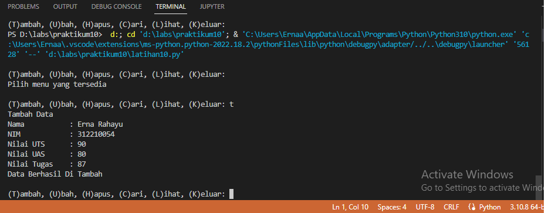
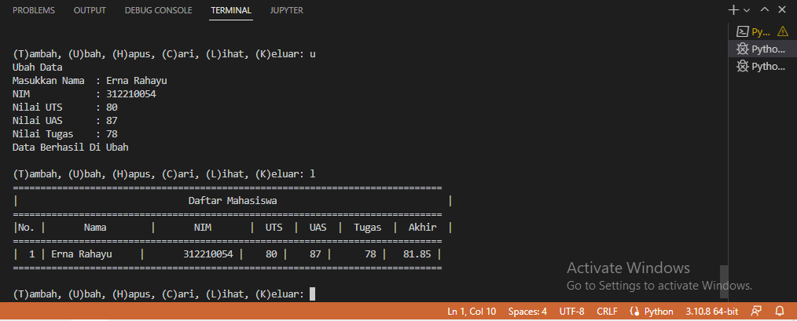
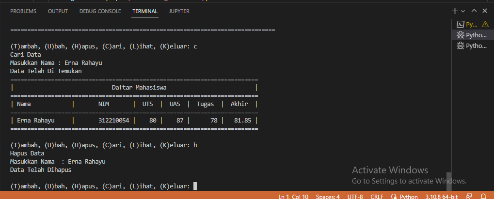
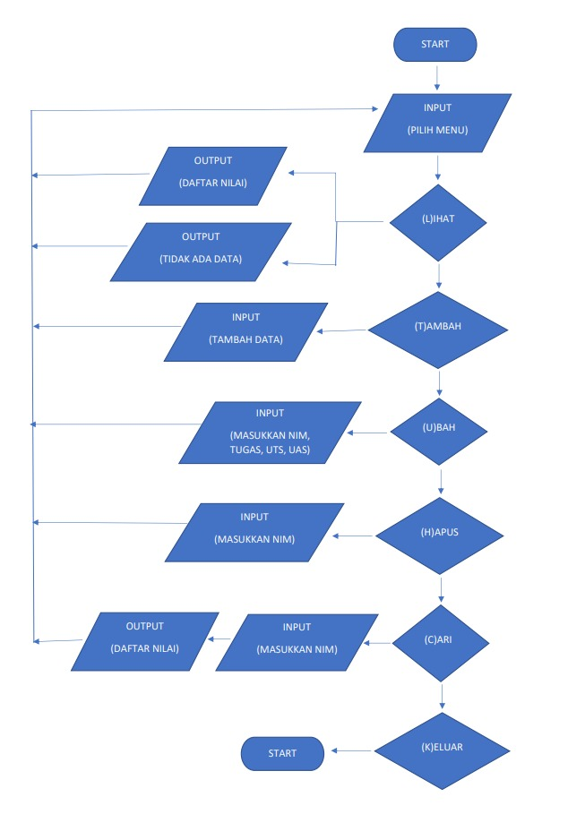

## Praktikum 5
# Program Data Mahasiswa 
Pada praktikum 5, kita akan membuat program sederhana untuk membuat data mahasiswa menggunakan Dictionary dengan python.

Codingan Praktikum 5
``` bash
data = {}

while True:
    x = input("\n(T)ambah, (U)bah, (H)apus, (C)ari, (L)ihat, (K)eluar: ")

    if x.lower() == 't':
        print("Tambah Data")
        nama = input("Nama           : ")
        nim = int(input("NIM            : "))
        uts = int(input("Nilai UTS      : "))
        uas = int(input("Nilai UAS      : "))
        tugas = int(input("Nilai Tugas    : "))
        akhir = tugas*30/100 + uts*35/100 + uas*35/100
        x[nama] = nim, uts, uas, tugas, akhir

    elif c.lower() == 'u':
        print("Ubah Data")
        nama = input("Masukkan Nama  : ")
        if nama in x.keys():
            nim = int(input("NIM            : "))
            uts = int(input("Nilai UTS      : "))
            uas = int(input("Nilai UAS      : "))
            tugas = int(input("Nilai Tugas    : "))
            akhir = tugas * 30 / 100 + uts * 35 / 100 + uas * 35 / 100
            x[nama] = nim, uts, uas, tugas, akhir
        else:
            print("Nama {0} tidak ditemukan".format(nama))

    elif x.lower() == 'h':
        print("Hapus Data")
        nama = input("Masukkan Nama  : ")
        if nama in x.keys():
            del x[nama]
        else:
            print("Nama {0} Tidak Ditemukan".format(nama))

    elif x.lower() == 'c':
        print("Cari Data")
        nama = input("Masukkan Nama : ")
        if nama in x.keys():
            print("="*73)
            print("|                             Daftar Mahasiswa                          |")
            print("="*73)
            print("| Nama            |       NIM       |  UTS  |  UAS  |  Tugas  |  Akhir  |")
            print("="*73)
            print("| {0:15s} | {1:15d} | {2:5d} | {3:5d} | {4:7d} | {5:7.2f} |"
                  .format(nama, nim, uts, uas, tugas, akhir))
            print("="*73)
        else:
            print("Nama {0} Tidak Ditemukan".format(nama))

    elif x.lower() == 'l':
        if x.items():
            print("="*78)
            print("|                               Daftar Mahasiswa                             |")
            print("="*78)
            print("|No. | Nama            |       NIM       |  UTS  |  UAS  |  Tugas  |  Akhir  |")
            print("="*78)
            i = 0
            for z in x.items():
                i += 1
                print("| {no:2d} | {0:15s} | {1:15d} | {2:5d} | {3:5d} | {4:7d} | {5:7.2f} |"
                      .format(z[0][:13], z[1][0], z[1][1], z[1][2], z[1][3], z[1][4], no=i))
            print("=" * 78)
        else:
            print("="*78)
            print("|                               Daftar Mahasiswa                             |")
            print("="*78)
            print("|No. | Nama            |       NIM       |  UTS  |  UAS  |  Tugas  |  Akhir  |")
            print("="*78)
            print("|                                TIDAK ADA DATA                              |")
            print("="*78)

    elif x.lower() == 'k':
        break

    else:
        print("Pilih menu yang tersedia")
``` 

# Penjelasan :
1.) Pertama kita membuat sebuah dictionary kosong yang nantinya akan diinputkan data ketika program dijalankan.

 ``` data = {} ```
2.) Lalu kita membuat kondisi perulangan dan sebuah keterangan untuk pilihan menu yang akan menjalankan program.

``` bash
while True:
    x = input("\n(T)ambah, (U)bah, (H)apus, (C)ari, (L)ihat, (K)eluar: ") 
```
3.) Membuat syntax untuk menambahkan data.
```bash 
    if x.lower() == 't':
        print("Tambah Data")
        nama = input("Nama           : ")
        nim = int(input("NIM            : "))
        uts = int(input("Nilai UTS      : "))
        uas = int(input("Nilai UAS      : "))
        tugas = int(input("Nilai Tugas    : "))
        akhir = tugas*30/100 + uts*35/100 + uas*35/100
        x[nama] = nim, uts, uas, tugas, akhir
``` 
Disini apabila kita menginputkan 't' maka kita akan diminta untuk menginputkan beberapa data. Data yang kita inputkan akan masuk ke dictionary 'x' yang telah dibuat tadi dengan data 'nama' sebagai keys dan sisanya sebagai valuesnya.

4.) Membuat syntax untuk mengubah data.

``` bash
    elif x.lower() == 'u':
        print("Ubah Data")
        nama = input("Masukkan Nama  : ")
        if nama in x.keys():
            nim = int(input("NIM            : "))
            uts = int(input("Nilai UTS      : "))
            uas = int(input("Nilai UAS      : "))
            tugas = int(input("Nilai Tugas    : "))
            akhir = tugas * 30 / 100 + uts * 35 / 100 + uas * 35 / 100
            x[nama] = nim, uts, uas, tugas, akhir
        else:
            print("Nama {0} tidak ditemukan".format(nama))
``` 

Apabila kita menginput 'u' maka akan ada keterangan untuk mengubah data dan kita akan diminta untuk menginputkan nama yang mau diubah datanya, apabila nama tidak ada maka outputnya "Nama {} tidak ditemukan". Dimana {} adalah nama/data yang mau kita ubah.

5.) Membuat syntax untuk menghapus data.

``` bash
    elif x.lower() == 'h':
        print("Hapus Data")
        nama = input("Masukkan Nama  : ")
        if nama in x.keys():
            del x[nama]
        else:
            print("Nama {0} Tidak Ditemukan".format(nama))
```
Apabila kita menginput 'h' maka kita akan diminta menginput nama yang akan dihapus. Jika nama ada di dalam dictionary, maka system akan menghapus keys/nama tersebut beserta valuesnya pada statement ``` del x[nama] ```.

6.) Membuat syntax untuk mencari data.

``` bash
    elif x.lower() == 'c':
        print("Cari Data")
        nama = input("Masukkan Nama : ")
        if nama in x.keys():
            print("="*73)
            print("|                             Daftar Mahasiswa                          |")
            print("="*73)
            print("| Nama            |       NIM       |  UTS  |  UAS  |  Tugas  |  Akhir  |")
            print("="*73)
            print("| {0:15s} | {1:15d} | {2:5d} | {3:5d} | {4:7d} | {5:7.2f} |"
                  .format(nama, nim, uts, uas, tugas, akhir))
            print("="*73)
        else:
            print("Nama {0} Tidak Ditemukan".format(nama))
``` 
Apabila kita menginputkan 'c' maka kita akan diminta untuk memasukkan nama yang akan dicari. Apabila nama yang dicari ada di dalam dictionary maka outputnya akan menampilkan data dari nama tersebut.

7.) Membuat syntax untuk melihat atau menampilkan data.

``` bash
    elif x.lower() == 'l':
        if x.items():
            print("="*78)
            print("|                               Daftar Mahasiswa                             |")
            print("="*78)
            print("|No. | Nama            |       NIM       |  UTS  |  UAS  |  Tugas  |  Akhir  |")
            print("="*78)
            i = 0
            for z in x.items():
                i += 1
                print("| {no:2d} | {0:15s} | {1:15d} | {2:5d} | {3:5d} | {4:7d} | {5:7.2f} |"
                      .format(z[0][:13], z[1][0], z[1][1], z[1][2], z[1][3], z[1][4], no=i))
            print("=" * 78)
        else:
            print("="*78)
            print("|                               Daftar Mahasiswa                             |")
            print("="*78)
            print("|No. | Nama            |       NIM       |  UTS  |  UAS  |  Tugas  |  Akhir  |")
            print("="*78)
            print("|                                TIDAK ADA DATA                              |")
            print("="*78)
``` 

Apabila kita menginput 'l' maka sistem akan menampilkan data - data yang sudah kita masukkan. Jika kita belum memasukkan data maka outputnya menjadi "TIDAK ADA DATA".

8.) Membuat syntax untuk menghentikan perulangan.

``` bash
    elif x. lower() == 'k':
        break
``` 
Apabila kita menginput 'k' maka program akan langsung berhenti.

9.) Membuat syntax untuk apabila memilih pilihan yang tidak ada di menu.

``` bash
    else:
        print("Pilih menu yang tersedia")
``` 
Jika kita menginputkan selain yang ada pada menu **(t, u, h, c, l, k)** maka kita akan diminta untuk memilih menu yang tersedia.

# Tampilan Program Saat Dijalankan

  **Tambah Data**
  

  **Ubah Data dan Lihat**
  

  **Cari Data dan Hapus**
  

  **Lihat Data dan Keluar**
  

  # Flowchart
  


